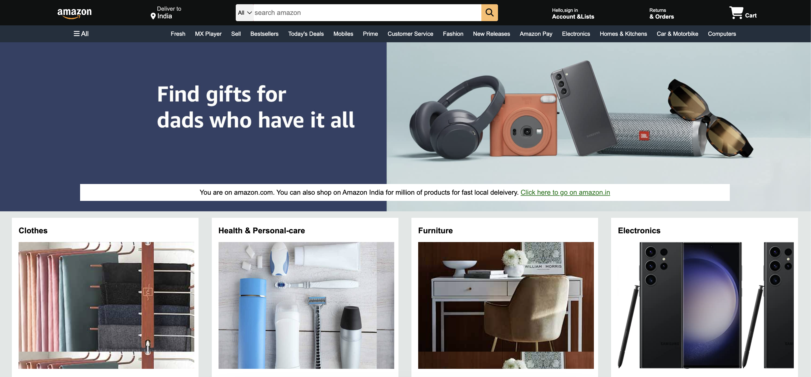

# 🛒 Amazon UI Clone

A front-end clone of Amazon's homepage built using **HTML** and **CSS**. This project replicates the user interface and layout of Amazon to practice responsive web design and CSS styling skills.

## 📸 Preview

## 

## 🧰 Tech Stack

- 💻 HTML5
- 🎨 CSS3
- 📐 Flexbox & Grid
- 📱 Responsive Design

## 🚀 How to Use

1. **Clone the repository**

```bash
git clone https://github.com/ishan2651712/amazon-ui-clone.git
cd amazon-ui-clone
```

2. **Open in Browser**

```bash
start index.html   # For Windows
open index.html    # For macOS
```

or just double-click index.html.

## 🎯 Features

- Amazon-style header with logo, search bar, and nav links
- Product categories and cards
- Footer similar to Amazon
- Responsive layout and hover effects

## 🧑‍🎓 Purpose

This project was created to improve front-end development skills by cloning a real-world website. It's purely for educational and portfolio purposes.
